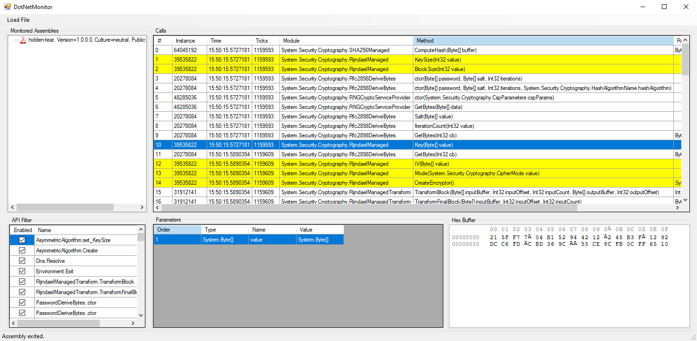

# DotNetMonitor

Heavily inspired by [APIMonitor](http://www.rohitab.com/apimonitor), but for .NET binaries. DotNetMonitor can hook .NET binaries (using [Harmony](https://github.com/pardeike/Harmony)) and capture API calls, even when the binary is obfuscated in most cases.



# Special Features

* Selecting a call will highlight all other calls from the same instance object
* `System.Random` sequences can be recreated with right-click
* UI and console binaries are supported

# Adding APIs

To add an API to monitor, simply create a new [Harmony patch class](https://harmony.pardeike.net/articles/patching.html) under the `Patches` directory. Inside the patched method, give `MainForm.DispatchApiCall` a `CallStruct` with the data to be collected. The extension method `WithValues` is necessary for proper collection of all parameter names with their values, including deep copies.

## Example Patch

```csharp
namespace DotNetMonitor.Patches
{
	[HarmonyPatch(typeof(MyClass))]
    class MyClassPatch
	{
		[HarmonyPostfix]
        [HarmonyPatch("Create", new Type[] { typeof(string) })]
        static void PostfixCreate(MyClass __instance, string parameter1, MyClass __result)
        {
            MainForm.DispatchApiCall(new CallStruct
            {
                Instance = __instance,
                MethodName = "Create",
                Parameters = MethodBase.GetCurrentMethod().GetParameters().WithValues(new CallLookup
                {
                    [nameof(parameter1)] = parameter1,
                    [nameof(__result)] = __result
                }),
            });
        }
	}
}
```

### Some Notes on Patches

* Generally you will want to use a postfix patch to catch the return, unless it is a Setter
* Interfaces (e.g. `ICryptoTransform`) cannot have a postfix or prefix patch, they require a transpiler... which is more complicated than I ever got into it
* Be careful not to cause stack overflows with postfixes that may hook indefinitely (e.g. failed experiment with `StringBuilder.ToString`...)

# Notes

* __Do not run malware thru DotNetMonitor on your host machine!!!__ It should go without saying that the loaded binary is executed in full; no breakpoints or anything are made. Always execute malware in a properly sandboxed virtual machine.
* This tool was originally written for ransomware analysis in mind, so mostly crypto-related classes are hooked.
* It's recommended to run DotNetMonitor as administrator; if the binary you are running with it elevates with UAC, you will likely lose it.
* New threads created by the injected binary are **not** hooked.
* The UI may freeze for a moment if it is flooded with calls; if it fully crashes, everything is still logged to `%USERPROFILE%\Desktop\harmony.log.txt`
* I wrote this project several years ago, and have forgotten many aspects of the internals without analyzing the code.
* The project has only been explicitly tested with Harmony v2.0.4.

## TODO

* Add more hooks
* Implement the API filter to actual hook/unhook desired APIs during runtime
    * Maybe have a config file for selected hooks?
* Display ASCII with the hex view
* Support passing command line arguments to the loaded binary
* Maybe do some anti-anti-debugging?